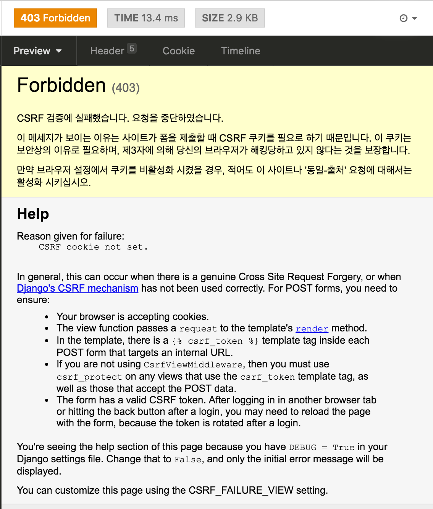

# Disableing Django Framework's CSRF Validation'

## What is CSRF?
CSRF(Cross-Site Request Forgery) is a type of a web application vulunbility.

Reference : [Cross Site Request Forgery protection](https://docs.djangoproject.com/en/2.1/ref/csrf/)


## Django and CSRF
Django Framework has a CSRF protection(validation) by default. And sometimes when I'm testing a API server made with Django, my request is considered a CSRF attsack.



## Disabling Django CSRF Validation
* Before
```Python
def my_view(request):
    return HttpResponse('Hello world')
```

* After
```Python
from django.views.decorators.csrf import csrf_exempt

@csrf_exempt
def my_view(request):
    return HttpResponse('Hello world')
```
